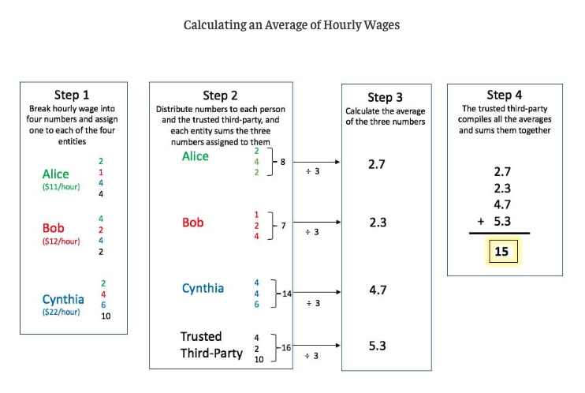
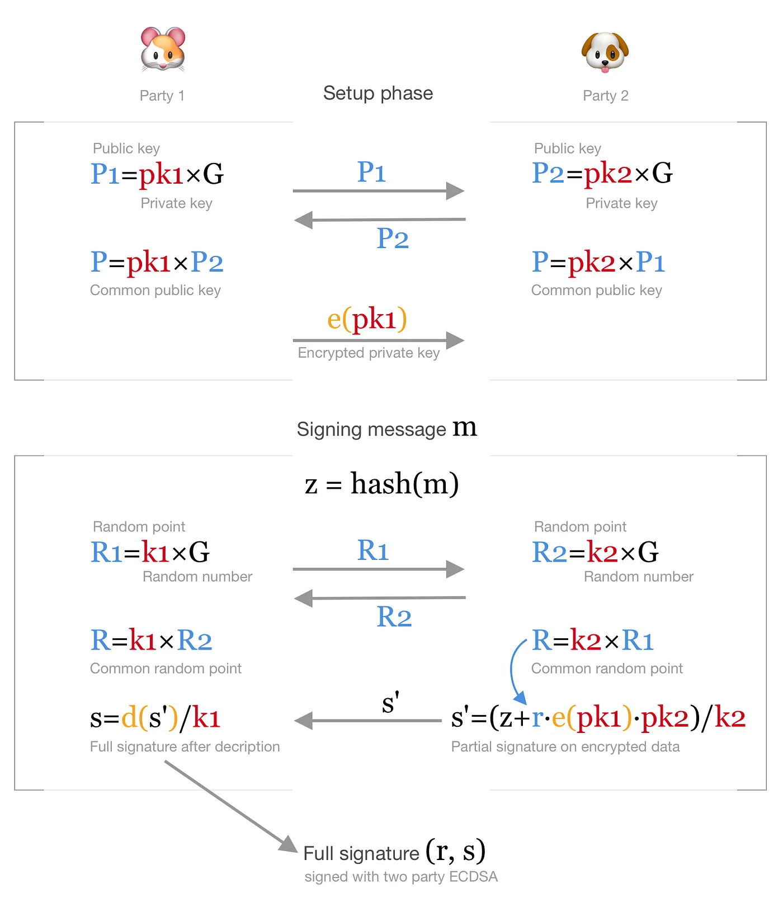

---
authors:
  - yakkle
date:
  created: 2025-01-20
categories:
  - Blockchain
---

# MPC(Multi-Party Computation)

<!-- more -->
## MPC 로 평균연봉 구하기

### 방법 1

- [Multiparty Computation - youtube](https://youtu.be/_kLET4k2xBQ?si=6u4DgrfnLZddinFN&t=215)

A, B, C 3명의 평균 연봉을 구하려고 할 때 A, B, C 가 자신의 연봉을 서로 공유하지 않고 평균을 계산하는 방법

| party  | 연봉     |
| ------ | ------- |
| A      | 100     |
| B      | 150     |
| C      | 200     |

- random(r)을 임의의 값(30)으로 정한다
- `m1 = A 연봉 + r` 을 B 에게 전달
  `m1 = 100 + 30 = 130`
- `m2 = B 연봉 + m1` 을 C 에게 전달
  `m2 = 150 + 130 = 280`
- `m3 = C 연봉 + m2` 을 A 에게 전달
  `m3 = 200 + 280 = 480`
- `avg = (m3 - r) / 3` 을 B, C 에게 공유
  `avg = (480 - 30) / 3 = 450 / 3 = 150`
- A, B, C 는 서로의 연봉을 모르지만 평균연봉이 150 이라는 것을 계산할 수 있다

### 방법 2

 

 [Secure Multi-Party Computation](https://chain.link/education-hub/secure-multiparty-computation-mcp)

## 2 party Computation with ECDSA ([Yehuda Lindell](https://eprint.iacr.org/2017/552.pdf))

!!! note
    * [Elliptic Curve Digital Signature Algorithm](https://en.wikipedia.org/wiki/Elliptic_Curve_Digital_Signature_Algorithm)
    * https://github.com/ethereumbook/ethereumbook/blob/develop/06transactions.asciidoc#how-digital-signatures-work

 - DKG(Distributed Key Generation)
    * [Distributed Key Generation](https://xiaohuiliu.medium.com/distributed-key-generation-3ef41ced01ed)
    * [What Distributed Key Generation Is](https://medium.com/toruslabs/what-distributed-key-generation-is-866adc79620)
 - [ECDSA is not that bad: two-party signing without Schnorr or BLS](https://medium.com/cryptoadvance/ecdsa-is-not-that-bad-two-party-signing-without-schnorr-or-bls-1941806ec36f)
    * Common Public Key
        - `P=pk1×P2=pk2×P1=pk1⋅pk2×G`
    * Signature (r, s)
        - `r=k1×R2=k2×R1=k1⋅k2×G`
        - `s=(z+r⋅pk1⋅pk2)/k1/k2`

 
 /// caption
 Simplified diagram of 2-party ECDSA signing. Blue values are public points, red values are secret, orange text represents homomorphic encryption and decryption.
 ///

## MPC Implementations

 - https://github.com/bnb-chain/tss-lib
 - https://github.com/ZenGo-X/gotham-city
 - https://github.com/fireblocks/mpc-lib
 - python MPC
    * https://github.com/lschoe/mpyc
 - https://github.com/rdragos/awesome-mpc
 - https://github.com/ZenGo-X/awesome-tss
