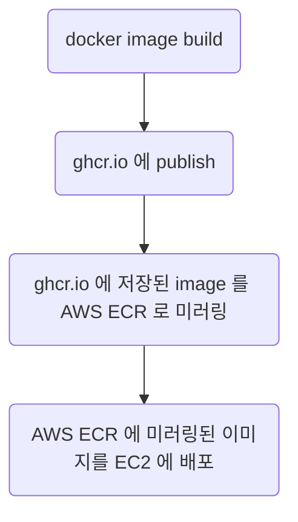

---
authors:
  - yakkle
date:
  created: 2025-11-05
categories:
  - DevOps
tags:
  - CD/CD
  - Github Action
---

# github action 으로 AWS EC2 에 배포하기

github private repo 에서 github private package(ghcr.io) 로 docker image 를 빌드하고 저장하고 있습니다. docker image 를 빌드하고 이미지를 ghcr.io 에 저장하는 것까지는 github action 으로 자동화 되어 있지만 EC2 서버에는 수동으로 배포하는 있습니다. 이를 github action 으로 자동화하는 방법을 정리했습니다.

!!! note
    ghcr.io 에 저장된 이미지를 EC2 서버에 자동으로 배포하는 것까지 github action 으로 처리하는 것이 목표입니다.

<!-- more -->
## Continuous Deployment 전략



## Github Action 설정

###  환경 변수, Secret 설정
Github Action workflow 에서 사용할 Secret 과 환경변수를 설정합니다.

#### Secret
- `EC2_INSTANCE_ID` : AWS EC2 instance id
- `ECR_REPOSITORY` : AWS ECR repository 이름
- `AWS_ROLE_TO_ASSUME`: [AWS credential](https://github.com/aws-actions/configure-aws-credentials?tab=readme-ov-file#quick-start-oidc-recommended)

#### Variable
- `AWS_REGION` : AWS region 이름(e.g., `ap-northeast-2`)
- `APP_DIR` : deploy 할 app directory
- `DEPLOY_DIRNAME` : `APP_DIR` 하위에 github private repo 를 clone 할 directory 이름
- `DEPLOY_KEY_NAME` : github private repo 를 clone 하기 위한 [deploy key](https://docs.github.com/en/authentication/connecting-to-github-with-ssh/managing-deploy-keys#deploy-keys) 가 저장된 Parameter Store 이름
- `DEPLOY_KEY_PATH` : Parameter Store 에서 가져온 deploy key 를 저장할 경로 (e.g., `/run/secrets/deploy_key`)

## Secret 관리
배포할 app 에서 사용하는 Secret 정보들을 EC2 에서 안전하게 사용하기 위해 Parameter Store 를 사용한다

### AWS Parameter Store
 - [Parameter Store](https://docs.aws.amazon.com/ko_kr/systems-manager/latest/userguide/systems-manager-parameter-store.html)

> AWS Systems Manager의 도구인 Parameter Store는 구성 데이터 관리 및 비밀 관리를 위한 안전한 계층적 스토리지를 제공합니다.
> 암호, 데이터베이스 문자열, Amazon Machine Image(AMI) ID, 라이선스 코드와 같은 데이터를 파라미터 값으로 저장할 수 있습니다.
> 값을 일반 텍스트 또는 암호화된 데이터로 저장할 수 있습니다.

!!! tip "AWS Secrets Manager"
    [AWS Secrets Manager](https://docs.aws.amazon.com/ko_kr/secretsmanager/latest/userguide/intro.html) 를 사용하면 수명 주기 동안 데이터베이스 자격 증명, 애플리케이션 자격 증명, OAuth 토큰,
    API 키 및 기타 보안 암호를 관리, 검색 및 교체할 수 있습니다.

## build and publish
배포할 이미지를 build 하고 container registry(ghcr.io) 에 push 합니다.

### workflow 작성 단계
1. docker build 를 위한 환경 설정 (docker/setup-qemu-action, docker/setup-buildx-action)
2. ghcr.io 로그인 (docker/login-action)
3. docker build 를 위한 metadata 추출 (docker/metadata-action)
4. docker 빌드 및 image push (docker/build-push-action)

### build_and_publish.yml workflow 예제

```yaml
name: Build and Publish

on:
  pull_request:
    branches: ["main"]
  push:
    branches: ["main"]
  workflow_dispatch:
    inputs:
      container_registry:
        description: 'Select container registry for production'
        required: true
        default: 'ghcr'
        type: choice
        options:
        - ghcr
        - ecr

env:
  CONTAINER_REGISTRY: ${{ github.event_name == 'workflow_dispatch' && inputs.container_registry || 'ghcr' }}

jobs:
  build:
    runs-on: ubuntu-latest
	permissions:
      contents: write
      packages: write
	steps:
      - name: Set up QEMU
        uses: docker/setup-qemu-action@v3

      - name: Set up Docker Buildx
        uses: docker/setup-buildx-action@v3

      - name: Log in to GHCR
        if: github.event_name != 'pull_request' && env.CONTAINER_REGISTRY == 'ghcr'
        uses: docker/login-action@v3
        with:
          registry: ghcr.io
          username: ${{ github.actor }}
          password: ${{ secrets.GITHUB_TOKEN }}

      - name: Extract metadata (tags, labels) for Docker
        id: meta
        env:
          REPOSITORY: 'repository/tagname'
          REGISTRY_HOST: 'ghcr.io'
        uses: docker/metadata-action@v5
        with:
          images: ${{ env.REGISTRY_HOST }}/${{ env.REPOSITORY }}
          flavor: |
            latest=false
          tags: |
            type=raw,value=latest,enable={{is_default_branch}}
            type=raw,value={{date 'YYYY-MM-DD' tz='Asia/Seoul'}},enable={{is_default_branch}}
            type=ref,event=pr
            type=sha
          labels: |
            org.opencontainers.image.source=https://github.com/owner/reponame
            org.opencontainers.image.description="image description"

      - name: Build and push to selected registry
        id: build
        uses: docker/build-push-action@v6
        with:
          context: .
          target: prod
          push: ${{ github.event_name != 'pull_request' }}
          platforms: linux/amd64,linux/arm64
          tags: ${{ steps.meta.outputs.tags }}
          labels: ${{ steps.meta.outputs.labels }}
          cache-from: type=gha,scope=${{ env.CONTAINER_REGISTRY }}
          cache-to: type=gha,mode=max,scope=${{ env.CONTAINER_REGISTRY }}
```

### Container registry
#### ghcr.io (Github Container Registry)
- main docker 이미지 저장소

#### AWS ECR(Elastic Container Registry)
- mirroring docker 이미지 저장소

!!! warning
    AWS EC2 에서 ghcr.io 에 private 으로 저장된 image 를 받아오도록 자동화를 해야 하는데,<br>
    자동화를 해결할 우아한 방법이 없기 때문에 AWS ECR 에 mirroring 하는 방법을 선택<br>
    https://github.com/orgs/community/discussions/24636


## deploy
container registry 에 push 된 이미지를 AWS EC2 에 pull 받아 container 를 실행합니다.

### 단계별 확인 후 workflow 작성
1. ghcr.io 에서 이미지를 내려받아 ECR 로 미러링
2. EC2 에서 ECR 이미지를 내려받기
3. 실행중인 docker container 를 중단하고 내려받은 새 image 로 실행
4. ECR 에 미러링한 이미지를 삭제

```yaml
jobs:
  deploy:
    runs-on: ubuntu-latest
    environment: production
    permissions:
      contents: read
      packages: read
      id-token: write
    env:
      GHCR_IMAGE_NAME: 'ghcr.io/repository/tagname:latest'
      AWS_REGION: ${{ vars.AWS_REGION }}

    steps:
      - name: Checkout repository
        uses: actions/checkout@v5
        with:
          sparse-checkout: |
            scripts

      - name: Log in to GHCR
        if: env.CONTAINER_REGISTRY == 'ghcr'
        uses: docker/login-action@v3
        with:
          registry: ghcr.io
          username: ${{ github.actor }}
          password: ${{ secrets.GITHUB_TOKEN }}

      - name: Configure AWS credentials
        uses: aws-actions/configure-aws-credentials@v5
        with:
          role-to-assume: ${{ secrets.AWS_ROLE_TO_ASSUME }}
          aws-region: ${{ env.AWS_REGION }}

      - name: Login to AWS ECR
        id: login-ecr
        uses: aws-actions/amazon-ecr-login@v2

      - name: Set env for ECR
        run: |
          REGISTRY_HOST=${{ steps.login-ecr.outputs.registry }}
          echo "ECR_REGISTRY_HOST=$REGISTRY_HOST" >> $GITHUB_ENV
          echo "ECR_IMAGE_NAME=$REGISTRY_HOST/${{ secrets.ECR_REPOSITORY }}:latest" >> $GITHUB_ENV

      - name: Mirroring GHCR to AWS ECR
        if: env.CONTAINER_REGISTRY == 'ghcr'
        run: |
          docker buildx imagetools create -t ${{ env.ECR_IMAGE_NAME }} ${{ env.GHCR_IMAGE_NAME }}
          DIGEST=$(docker buildx imagetools inspect --format='{{ json .Manifest.Digest }}' ${{ env.ECR_IMAGE_NAME }})
          echo "ECR_MANIFEST_DIGEST=$DIGEST" >> $GITHUB_ENV

      - name: Install uv
        uses: astral-sh/setup-uv@v6

      - name: Deploy to AWS EC2 with boto3
        env:
          EC2_INSTANCE_ID: ${{ secrets.EC2_INSTANCE_ID }}
          APP_DIR: ${{ vars.APP_DIR }}
          DEPLOY_DIRNAME: ${{ vars.DEPLOY_DIRNAME }}
          DEPLOY_KEY_NAME: ${{ vars.DEPLOY_KEY_NAME }}
          DEPLOY_KEY_PATH: ${{ vars.DEPLOY_KEY_PATH }}
        run: uv run scrpits/deploy.py

      - name: Delete mirroring image
        if: env.CONTAINER_REGISTRY == 'ghcr'
        run: |
          TAGGED_IDS=$(aws ecr list-images --repository-name ${{ secrets.ECR_REPOSITORY }} --query 'imageIds[*]' --filter tagStatus=TAGGED)
          aws ecr batch-delete-image --repository-name ${{ secrets.ECR_REPOSITORY }} --image-ids "$TAGGED_IDS"

          IMAGE_IDS=$(aws ecr list-images --repository-name ${{ secrets.ECR_REPOSITORY }} --query 'imageIds[*]')
          aws ecr batch-delete-image --repository-name ${{ secrets.ECR_REPOSITORY }} --image-ids "$IMAGE_IDS"

```

### AWS ssm(Simple System Manager)
ssm 으로 EC2 에 배포 스크립트를 실행하도록 명령을 보냅니다.

### deploy script with [boto3](https://boto3.amazonaws.com/v1/documentation/api/latest/guide/quickstart.html)

```python
# /// script
# requires-python = ">=3.13"
# dependencies = [
#    "boto3~=1.40",
# ]
# ///

import os
import boto3

EC2_INSTANCE_ID = os.getenv("EC2_INSTANCE_ID")
STEP_SUMMARY = os.getenv("GITHUB_STEP_SUMMARY")

scripts_template = """
#!/bin/bash
set -e

echo "## Start deployment script."

mkdir -p /run/secrets
chmod 700 /run/secrets

aws ssm get-parameter --name "${DEPLOY_KEY_NAME}" \
    --with-decryption --query Parameter.Value \
    --output text > ${DEPLOY_KEY_PATH}

chmod 600 ${DEPLOY_KEY_PATH}

mkdir -p ~/.ssh
ssh-keyscan -t rsa github.com >> ~/.ssh/known_hosts

mkdir -p ${APP_DIR}

DEPLOY_DIR=${APP_DIR}/${DEPLOY_DIRNAME}

if [ -d "${DEPLOY_DIR}" ]; then
    cd ${DEPLOY_DIR}

    echo "## Stopping and removing existing containers..."
    docker compose down

    echo "### git pull from github repo..."
    GIT_SSH_COMMAND="ssh -i ${DEPLOY_KEY_PATH} -o IdentitiesOnly=yes" \
    git pull
else
    echo "### git clone from github repo..."
    GIT_SSH_COMMAND="ssh -i ${DEPLOY_KEY_PATH} -o IdentitiesOnly=yes" \
    git clone --depth=1 --filter=blob:none --sparse git@github.com:damoang/ang-gnu-guide.git ${DEPLOY_DIR}
    cd ${DEPLOY_DIR}
fi

shred -u ${DEPLOY_KEY_PATH}

aws ecr get-login-password --region ${AWS_REGION} | docker login --username AWS --password-stdin ${ECR_REGISTRY_HOST}

echo "### docker pull..."
docker pull ${ECR_IMAGE_NAME}

echo "### create docker tag..."
docker tag ${ECR_IMAGE_NAME} damoang/damoang-guide:latest

echo "### show damoang guide images..."
docker images -f "label=org.opencontainers.image.title=ang-gnu-guide"

echo "## Starting containers in detached mode..."
export AWS_REGION=${AWS_REGION}
docker compose up -d

echo "Latest image digest: ${ECR_MANIFEST_DIGEST}"

docker rmi ${ECR_IMAGE_NAME}

echo "### docker logout..."
docker logout ${ECR_REGISTRY_HOST}

echo "## Deployment script completed."
"""

def main() -> None:
    client = boto3.client("ssm")

    scripts = os.path.expandvars(scripts_template)

    response = client.send_command(
        InstanceIds=[EC2_INSTANCE_ID],
        DocumentName="AWS-RunShellScript",
        Parameters={"commands": [scripts]}
    )

    with open(STEP_SUMMARY, "a") as summary_file:
        command_id = response["Command"]["CommandId"]
        print(f"{command_id=}", file=summary_file)

        waiter = client.get_waiter("command_executed")
        try:
            waiter.wait(
                CommandId=command_id,
                InstanceId=EC2_INSTANCE_ID,
                WaiterConfig={"Delay": 5, "MaxAttempts": 10}
            )
        except Exception as e:
            print(f"error: {e}", file=summary_file)
            raise
        finally:
            output = client.get_command_invocation(
                CommandId=command_id,
                InstanceId=EC2_INSTANCE_ID,
            )

            print("\n# Execute Results\n", file=summary_file)
            print(output["StandardOutputContent"], file=summary_file)

            if output["StandardErrorContent"]:
                print("\n# Error Logs\n", file=summary_file)
                print("```\n", file=summary_file)
                print(output["StandardErrorContent"], file=summary_file)
                print("\n```\n", file=summary_file)

if __name__ == "__main__":
    main()
```

## workflows 업데이트
A workflow 에서 B workflow 실행하기

- [workflow_run](https://docs.github.com/en/actions/reference/workflows-and-actions/events-that-trigger-workflows#workflow_run)
	- 다른 workflow 를 trigger 할 수는 있지만 값을 전달할 수는 없음
- [repository_dispatch](https://docs.github.com/en/actions/reference/workflows-and-actions/events-that-trigger-workflows#workflow_dispatch)
	- 다른 workflow 에 값 전달 가능

#### build_and_publish.yml
build job 맨 아래 deploy event 를 trigger 하는 step 추가합니다.

```yaml
jobs:
  build:
    steps:
      - name: Trigger deploy event
        if: success() && github.event_name != 'pull_request'
        uses: peter-evans/repository-dispatch@v4
        with:
          event-type: deploy-event
          client-payload: '{"container_registry": "${{ env.CONTAINER_REGISTRY }}"}'
```

#### deploy.yml
build_and_publish.yml 에 추가한 event-type 으로 repository_dispatch 이벤트를 받도록 설정합니다.

```yaml
name: Deploy to AWS

on:
  repository_dispatch:
    types: [deploy-event]
  workflow_dispatch:

env:
  CONTAINER_REGISTRY: ${{ github.event.client_payload.container_registry || 'ghcr' }}
```
